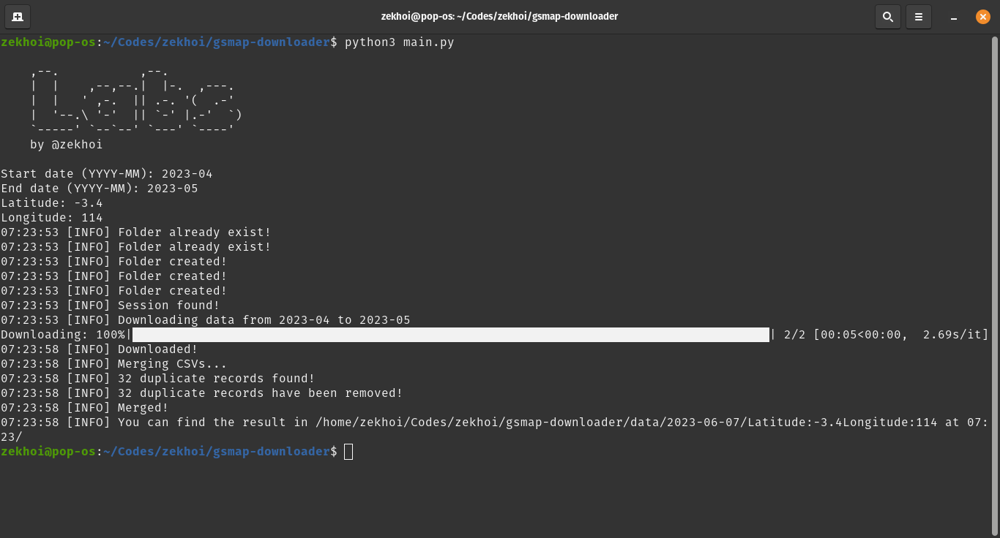

# GSMap Downloader
GSMap Downloader written in python

## Install required libraries

```
pip install -r requirements.txt
```

## Run the application

```
python main.py
```

###
Insert the start date with the format YYYY-MM and the end date with the same format. The program will download the data in the folder "data" in the same directory of the script.

You have to login with your GSMap account. If you don't have one, you can register [here](https://sharaku.eorc.jaxa.jp/GSMaP/registration.html). After you have logged in with the downloader, you can download the data from the website without the need to login again because the downloader will save the authorization code in the file "session.txt" in the same directory of the script.

